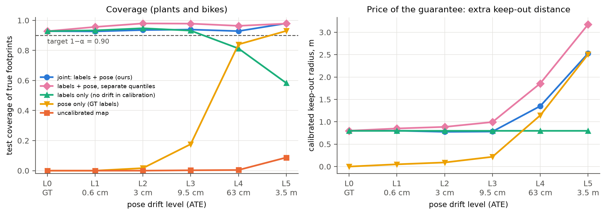
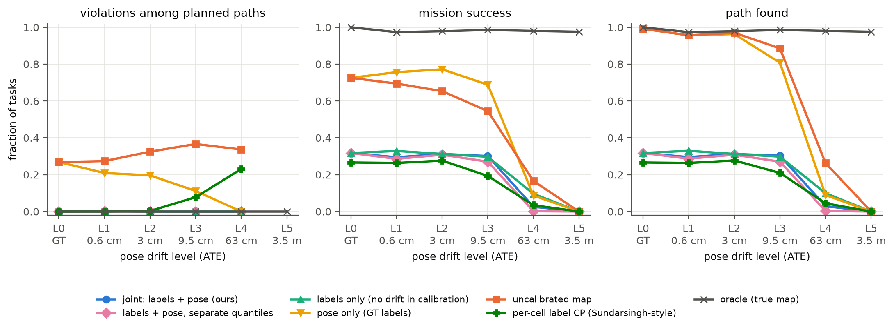
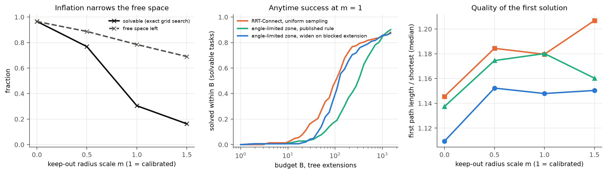

# calibrated-semantic-nav

**Can a robot plan safely on an open-vocabulary semantic map when both the labels and its own pose are wrong?**
This repository measures how label errors and pose drift turn into safety violations of a planner, and tests
whether **one calibrated quantity — the *miss distance*** — gives the planner a statistical guarantee that covers
both error sources at once.

Test task for the BE2R lab (ITMO), direction *semantic mapping, visual grounding and navigation*;
also the first step of a master's thesis on motion planning under uncertainty.
Full write-up (in Russian): [`report/report.pdf`](report/report.pdf). Decision log: [`docs/journal.md`](docs/journal.md).

## Key findings

21 ReplicaCAD scenes from OSMa-Bench, per-class conformal calibration at α = 0.1, 200 random scene splits
(13 calibration / 8 test), six levels of pose drift. Full tables: [`results/tables/`](results/tables).

1. **An open-vocabulary map almost never contains an object's full true footprint.** Coverage of the uncalibrated
   map is ≤ 0.01 for bikes and plants, and a planner that trusts it passes closer than the 0.5 m safety distance to a
   real plant or bike in **27–37 % of its paths** (L0–L3).
2. **Calibrating only labels is not enough.** Per-cell label calibration (Sundarsingh et al.-style) reaches 1.00
   without drift only by declaring every occupied cell possibly hazardous, and drops to **0.73 at 3 cm** of pose drift
   and 0.17 at 63 cm (bike). A labels-only radius holds while drift ≪ label error (≤ 10 cm ATE) but falls to
   **0.76 at 63 cm**.
3. **Calibrating only pose is not enough either:** a radius calibrated with ground-truth labels covers ≤ 0.22 up to
   9.5 cm ATE — it cannot see detector errors.
4. **Joint miss-distance calibration keeps 0.93–0.94 coverage at every drift level** with the smallest valid radius:
   at 63 cm ATE 1.18 m vs 1.61 m for the sum of separate quantiles (bike), 1.53 vs 2.11 m (plant). In missions,
   every calibrated arm has **zero violations**.
5. **The price is paid by perception.** The certified keep-out (~1.3 m) leaves a path in only ~30 % of pass-by tasks,
   versus 98 % for a planner on the true map. For the TV stand, which the detector confidently labels "bench" or
   "rug" in 2 of 21 scenes, honest calibration **refuses** to certify the class (abstention 0.71–0.95); planning with
   that fallback nearly immobilises the robot.
6. **Map quality does not predict mission safety:** Spearman ρ = −0.16 (p = 0.57) between scene mIoU and the
   violation rate of the uncalibrated planner.
7. **Planner side (thesis bridge):** on calibrated maps the angle-limited sampling zone of a bidirectional RRT needs
   2–3× more tree extensions than uniform sampling; widening the zone after blocked extensions brings this to
   1.1–1.4× and gives the shortest first paths (1.11–1.15 vs 1.15–1.21 of optimal). Free space, not search, limits
   solvability.

## The problem in one paragraph

Open-vocabulary maps (ConceptGraphs, BBQ, OpenScene) let a robot avoid "the plant" or "the bike" by name.
Their labels come from a detector that makes mistakes, and their geometry comes from a pose estimate that drifts.
Benchmarks such as [OSMa-Bench](https://github.com/be2rlab/OSMa-Bench) show how much these maps degrade, but score
them as images, without a robot moving through them. The planners that do carry statistical guarantees on top of
uncertain perception — conformalized semantic maps (Sundarsingh et al., RA-L 2026) and Perceive With Confidence
(Mei et al., IJRR 2025) — both assume that **the robot's pose is known**. And separately calibrated modules do
not compose into a calibrated system (Baral, IROS 2026 workshop). The open question: *what guarantee does a planner
get when label error and pose error act together, and how should it be calibrated?*

## Method

Everything is expressed in the frame the planner actually uses: the drifted world as the robot believes it at
query time `q`. A map built with drifted poses places an object seen at frame `k` at `D_k p`; the object is truly at
`D_q p` (`D_k = T̂_k T_k⁻¹` is the accumulated pose error).

For an avoid class `k` (indoor plant, TV stand, bike) the map region is `A_λ(k)` = occupied cells whose
score-weighted fraction of class-`k` observations is at least `λ`. The **miss distance** of a scene is

```
s_k(Ω) = min( R_max ,  max over true objects e of class k  max over x in e's true footprint  dist(x, A_λ(k)) )
```

A wrong or missing label makes it large; a pose shift makes it equal to the shift — one number absorbs both.
With one score per scene (cells and frames of a scene are not exchangeable) the split-conformal quantile `q̂_k` of
`n` calibration scenes gives `P(every true class-k footprint ⊆ A_λ(k) ⊕ B(q̂_k)) ≥ 1 − α`. A planner keeping
`dist(x, A_λ(k)) ≥ d + q̂_k` therefore keeps true distance `≥ d` (triangle inequality) — for **any** planner.
The planner decides whether a path still exists once the free space is narrowed.

Compared arms share the same region and differ only in what the radius is calibrated on:

| arm | radius calibrated on |
|---|---|
| uncalibrated | — (radius 0) |
| labels only | detector map at ground-truth poses |
| pose only | ground-truth-label map built with drifted poses |
| separate | labels-only radius + pose-only radius, each at α |
| **joint (ours)** | detector map built with drifted poses |
| per-cell label CP (reference) | Sundarsingh et al.-style per-cell label sets, no inflation |

## Setup

- **Data:** [OSMa-Bench](https://huggingface.co/datasets/warmhammer/OSMa-Bench_dataset) ReplicaCAD scenes
  (RGB-D, GT semantics and poses; every 8th frame, ~0.2 GB). `apt_0` is the dev scene (all design choices), the
  other scenes are for calibration and test. The published dataset contains one lighting condition per scene.
- **Perception:** YOLO-World v2-s with the 98 ReplicaCAD object classes as prompts (CLIP text embeddings baked into
  the weights), depth-consistent box masks, 5 cm top-down grid, fusion by averaging. 24 ms/frame on Apple M (MPS).
- **Pose drift:** planar odometry-style noise proportional to motion; six levels calibrated once on the dev scene to
  published magnitudes — L1 ATE 0.6 cm, L2 3 cm, L3 9.5 cm, L4 63 cm (≈3 % of path), L5 3.5 m (≈16 %, stress);
  10 realizations per level ([protocol](docs/drift_protocol.md)).
- **Calibration:** α = 0.1, 200 random splits of 21 scenes into 13 calibration / 8 test; an arm that cannot produce a finite radius abstains
  (vacuous certificate), counted as covered and reported separately.
- **Missions:** "pass-by" tasks — start and goal ≥ 1.5 m from avoid objects, but the shortest geometric path passes
  within 0.5 m of one, so a safe detour exists and an over-trusting planner cuts the corner. Dijkstra on the predicted
  map, judged against the true geometry in the planner frame; parameters calibrated leave-one-scene-out; a class whose
  certificate abstains falls back to "every occupied cell may be that class". Main configuration: plant + bike;
  system configuration: all three classes.
- **Planner bridge:** RRT-Connect, the angle-limited dynamic sampling zone of a bidirectional RRT (published rule),
  and a variant that widens the zone after blocked extensions — same 1500-extension budget, common random numbers.

## Figures

**Coverage and the price of the guarantee** (plants and bikes; per-class panels in
[`coverage_by_class.png`](results/figures/coverage_by_class.png)):



**Missions** (plant + bike, 233 pass-by tasks in 15 scenes, 5 drift realizations per level):



**Sampling-based planners on calibrated maps** (L2, keep-out radius scaled by m):



**Map quality vs mission safety:** [`miou_vs_violations_pb.png`](results/figures/miou_vs_violations_pb.png)

## Reproduce

Python 3.12, CPU or Apple MPS; ~0.2 GB of data, ~25 MB of detector weights.

```bash
python3.12 -m venv .venv && .venv/bin/pip install -r requirements.txt && .venv/bin/pip install -e .
.venv/bin/python scripts/download_subset.py $(cat configs/scenes_replicacad.txt) --step 8   # ~0.3 GB
.venv/bin/python scripts/run_pipeline.py --seeds 10      # detections + calibration scores per scene
.venv/bin/python scripts/analyze_coverage.py              # per-class coverage, radius, abstention
.venv/bin/python scripts/scene_metrics.py                # map mIoU per scene
.venv/bin/python scripts/run_missions.py --avoid indoor_plant bike --out results/missions_pb   # missions, LOSO
.venv/bin/python scripts/analyze_missions.py --dir results/missions_pb --tag _pb
.venv/bin/python scripts/run_planner_bridge.py --avoid indoor_plant bike --out results/tables/planner_bridge_pb_0.csv
.venv/bin/python scripts/analyze_bridge.py --tag _pb
.venv/bin/python scripts/make_report_tables.py && (cd report && tectonic report.tex)
.venv/bin/python -m pytest -q                             # 18 unit tests
```

The first detector run downloads YOLO-World v2-s and CLIP once to embed the prompts; afterwards the vocabulary is
baked into `models/yolov8s-worldv2-vocab98.pt` and CLIP is not needed.

## Repository layout

```
src/s2m/
  data.py        OSMa-Bench subset download and scene loading
  perception.py  YOLO-World wrapper, cached detections, depth-consistent box masks
  mapping.py     pose-independent frame observations, maps under arbitrary poses
  drift.py       planar odometry drift, ATE, level calibration
  entities.py    avoid-class objects from the ground-truth map
  conformal.py   split-CP quantile, miss distance, per-cell label score
  experiment.py  scores per scene x drift level x realization
  analysis.py    calibration arms, per-class coverage over scene splits
  planning.py    Dijkstra on the 8-connected grid, path evaluation
  missions.py    reach-avoid tasks, keep-out zones per arm, judgement against the truth
  rrt.py         RRT-Connect and the angle-limited dynamic sampling zone
scripts/         download, pipeline, analysis and figure scripts
configs/         drift levels, scene list
docs/            decision log, drift protocol
report/          LaTeX report (Russian)
results/         scores, tables, figures
tests/           unit tests (drift, conformal coverage, scores, planners)
```

## Limitations (read before citing a number)

- **Synthetic pose drift.** OSMa-Bench ships ground-truth poses only; drift is an odometry-style model without loop
  closures ([protocol](docs/drift_protocol.md)). Real SLAM error is correlated with scene appearance, which is
  exactly where separate calibration is expected to *under*-cover rather than over-pay.
- **One lighting condition.** The published OSMa-Bench data contains `baseline` only (22 ReplicaCAD scenes); the
  other conditions require re-rendering with HaDaGe on a GPU.
- **Few, related scenes.** ReplicaCAD scenes are re-arrangements of one apartment; 13 calibration scenes make the
  coverage of a single calibration draw widely spread (10th percentile ≈ 0.75–0.83 for the joint arm, as expected
  from the Beta law of split conformal coverage at small n).
- **Lightweight perception.** A box detector with depth-consistent masks, not a full mapper (ConceptGraphs/BBQ).
- **2D, planar motion; no execution-time localization error.** The guarantee holds in the planner frame at query time.
- **Post-hoc choice.** Avoid classes and `λ0` were fixed on the dev scene; dropping the TV stand from the *mission*
  experiments was decided after seeing that its certificate abstains — both configurations are reported.
- **Novelty.** No work with a joint distribution-free label + pose guarantee with the planner in the loop was found
  among the citers of the closest papers and in arXiv/OpenAlex queries (2 Oct 2026); Semantic Scholar keyword
  search was unavailable on those days.

## References

1. Popov et al. *OSMa-Bench: Evaluating Open Semantic Mapping Under Varying Lighting Conditions.* IROS 2025. DOI 10.1109/IROS60139.2025.11247603
2. Kurkova, Popov, Kolyubin. *OSMa-Bench++.* arXiv:2605.26831 (ICRA 2026 workshop)
3. Gu et al. *ConceptGraphs.* ICRA 2024. DOI 10.1109/ICRA57147.2024.10610243
4. Sundarsingh et al. *Safe Planning in Unknown Environments Using Conformalized Semantic Maps.* RA-L 2026. DOI 10.1109/LRA.2026.3668466
5. Mei et al. *Perceive With Confidence.* IJRR 2025. DOI 10.1177/02783649251378151
6. Kumar et al. *Learnable Conformal Prediction with Context-Aware Nonconformity Functions.* ICRA 2026. arXiv:2509.21955
7. Natraj, Sinopoli, Kantaros. *Conformal Constraint Tightening for Chance-Constrained Motion Planning.* arXiv:2607.22409
8. Baral. *Marginal Calibration Does Not Compose.* arXiv:2609.23731 (IROS 2026 workshop)
9. Sier et al. *P-POSEMEM.* arXiv:2609.15475
10. Correia Marques et al. *On the Overconfidence Problem in Semantic 3D Mapping.* ICRA 2024. DOI 10.1109/ICRA57147.2024.10611306
11. Cheng et al. *YOLO-World.* CVPR 2024. DOI 10.1109/CVPR52733.2024.01599
12. Rotondi et al. *3D Scene Graphs: Open Challenges and Future Directions.* arXiv:2606.19383
13. Angelopoulos, Bates. *A Gentle Introduction to Conformal Prediction.* arXiv:2107.07511
