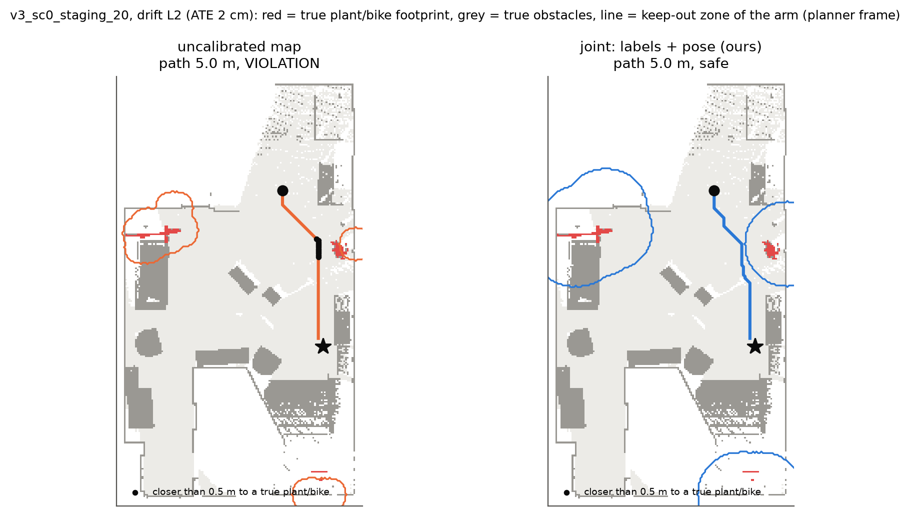

<h1 align="center">One Margin for Two Errors</h1>
<p align="center"><b>Conformal calibration of open-vocabulary semantic maps under label and pose uncertainty</b></p>
<p align="center">
  <a href="paper/paper.pdf">Paper (PDF, 5 pages)</a> ·
  <a href="report/report.pdf">Technical report (Russian, full)</a> ·
  <a href="docs/journal.md">Decision log</a> ·
  <a href="#reproduce">Reproduce</a>
</p>

<p align="center"></p>
<p align="center"><sub>One pass-by task at 2 cm pose drift. The uncalibrated keep-out zone (orange) misses part of the real
plant, and the shortest path passes within 0.5 m of it (black). The joint margin (blue) covers it, and the path detours.</sub></p>

> Test task for the BE2R lab (ITMO), direction *semantic mapping, visual grounding and navigation*, and the
> first step of a master's thesis on motion planning under uncertainty. Not peer reviewed.

## TL;DR

A robot that avoids "the plant" on an open-vocabulary map gets two errors at once:
- the detector under-covers or mislabels the object;
- the pose estimate drifts, so the object is drawn in the wrong place.

Published planners with statistical guarantees calibrate only the first and assume a known pose. We calibrate one
per-scene quantity, the **miss distance**: how far the true object sticks out of its class region on the map built
with the estimated poses, in the planner's frame. Its conformal quantile is a keep-out margin that covers both
errors and certifies **any** planner.

Coverage of the guarantee *"every true bike lies inside the keep-out margin"* at 1 − α = 0.9
(21 ReplicaCAD scenes, 200 calibration/test splits). Drift is labelled by the median ATE over the scenes. Plants
behave the same; see the [table](results/tables/coverage.csv).

| calibration of the margin | known pose | 2 cm drift | 45 cm drift | margin at 45 cm |
|---|:-:|:-:|:-:|:-:|
| none (map as is) | 0.00 | 0.00 | 0.01 | 0 |
| per-cell label sets (Sundarsingh et al.-style) | 1.00¹ | 0.73 | 0.17 | — |
| labels only (calibrated without drift) | 0.93 | 0.94 | **0.76** | 0.75 m |
| pose only (calibrated with true labels) | 0.00 | 0.03 | 0.82 | 0.90 m |
| labels + pose, sum of separate quantiles | 0.93 | 0.98 | 0.97 | 1.60 m |
| **joint miss distance (this work)** | **0.93** | **0.94** | **0.93** | **1.17 m** |

¹ only by declaring every occupied cell hazardous (calibrated threshold λ* = 0).

In missions, the uncalibrated planner passes closer than 0.5 m to a real plant or bike in 27–37 % of its paths on hard
pass-by tasks and in 4–6 % of unselected tasks. Every calibrated planner has **zero** such paths.

## Key findings

1. **Single-source calibration breaks under the other error.**
   - Labels-only margins hold while drift is small compared with the label error (≤ 7 cm ATE) and fail at
     odometry-level drift (0.76 at 45 cm).
   - Per-cell label sets fail already at 2 cm (0.73) because they have no geometric slack.
   - Pose-only margins cannot see detector errors (≤ 0.22 up to 7 cm).
2. **The joint margin holds 0.93–0.94 at every drift level.** At 45 cm drift it is 27 % smaller than the sum of
   separate quantiles: 1.17 vs 1.60 m for the bike, 1.52 vs 2.10 m for the plant.
3. **Against the closest method, in its own setting.**
   - In its setting (known pose, closed 5-class vocabulary, 1 − α = 0.95, unselected tasks) the two are **equal**:
     mission success 0.43 vs 0.42, no unsafe missions.
   - With 2 / 7 cm drift its coverage falls to 0.42 / 0.10. Ours stays at 0.94 and succeeds more often:
     0.61 / 0.50 vs 0.40 / 0.32.
   - With the open vocabulary ours succeeds 1.8× more often already at known pose (0.78 vs 0.43).
   - Label-set calibration degenerates to "every occupied cell is hazardous" at every grid size from 5 cm to 1 m,
     because the detector misses parts of some objects completely. A distance can still say "the object is nearby".
4. **The price is set by perception, not by the risk level.**
   - The joint planner finds a safe path in 78 % (known pose) to 68 % (7 cm drift) of unselected tasks, and in
     ~30 % of deliberately hard pass-by tasks. A planner on the true map solves 98–100 %.
   - Raising α from 0.1 to 0.3 shrinks the margin by only 0.2 m.
   - MobileSAM masks cut the typical bike miss from 0.43 to 0.05 m, but not the worst scene, which sets the margin
     with 13 calibration scenes.
   - The TV stand, labelled "bench" or "rug" in 2 of 21 scenes, cannot be certified at all (abstention 0.71–0.95).
5. **The sum of separate quantiles can under-cover.** Its guarantee is only 1 − 2α. Take real label errors and rare
   localization failures placed in scenes where labels are good: the sum covers 0.66 at a 0.70 target. The joint
   quantile stays at 0.71–0.78 however the failures are placed.
6. **Real visual odometry** (Open3D RGB-D, frame to frame, no loop closure; median ATE 78 cm, up to 3.9 m).
   - The labels-only certificate silently drops to 0.67.
   - The joint one stays valid but abstains in most splits: without loop closure there is no useful certificate,
     and the calibration says so.
   - Calibrated on ReplicaCAD, the guarantee does not transfer to HM3D scenes: one of the two visible plants is missed.
7. **Map quality does not predict mission safety.** Spearman ρ = −0.16 (p = 0.57, 15 scenes) between scene mIoU
   and the violation rate of the uncalibrated planner.
8. **Planner side (thesis bridge).** On calibrated maps the angle-limited sampling zone of a bidirectional RRT needs
   2.3–3.0× more tree extensions than uniform sampling. Widening the zone after blocked extensions brings this to
   1.2–1.4× without longer first paths.

## Robustness checks

| check | what changes | result |
|---|---|---|
| risk level | α = 0.05 / 0.1 / 0.2 / 0.3 | joint at nominal for every α; pass-by tasks solved 10 / 30 / 31 / 31 % |
| composition stress test | rare localization failures placed with / against / independently of label errors | separate 0.76–0.84 / down to 0.66 / 0.73–0.81 at a 0.70 target; joint 0.71–0.78 |
| segmentation | MobileSAM masks instead of box + depth | typical miss ~9× smaller, margin unchanged (set by the worst scene) |
| pose error | Open3D RGB-D odometry instead of synthetic drift | labels-only 0.67; joint 0.93, abstains in 60–86 % of splits |
| scene family | calibrate on ReplicaCAD, test on HM3D | coverage 0.5 on the 2 scenes with a visible plant |
| grid resolution | 5 cm … 1 m, per-cell label sets | λ* = 0 everywhere; their keep-out takes 64 % → 100 % of free space |
| region shape | convex hull / closing of class regions (dev scene) | no change in miss distance |

## Method

Everything is expressed in the frame the planner uses: the drifted world as the robot believes it at query time
`q`. A map built with drifted poses places an object seen at frame `k` at `D_k p`, but the object is truly at
`D_q p`. Here `D_k = T̂_k T_k⁻¹` is the accumulated pose error. The region of class `k` is
`A_λ(k)` = occupied cells whose score-weighted fraction of class-`k` observations is at least `λ`. The miss
distance of a scene is

```
s_k(Ω) = min( R_max ,  max over true objects e of class k   max over x in e's footprint   dist(x, A_λ(k)) )
```

A wrong or missing label makes it large; a pose shift makes it equal to the shift. There is one score per scene,
because cells and frames of a scene are not exchangeable. The split-conformal quantile `q̂_k` of `n` calibration
scenes gives `P(every true class-k footprint ⊆ A_λ(k) ⊕ B(q̂_k)) ≥ 1 − α`. A planner that keeps
`dist(x, A_λ(k)) ≥ d + q̂_k` therefore keeps a true distance `≥ d` by the triangle inequality, whatever the planner.

| arm | margin calibrated on |
|---|---|
| uncalibrated | — (margin 0) |
| labels only | detector map at ground-truth poses |
| pose only | ground-truth-label map built with drifted poses |
| separate | labels-only margin + pose-only margin, each at α |
| **joint (ours)** | detector map built with drifted poses |
| per-cell label sets (reference) | Sundarsingh et al.-style label sets per cell, no inflation |

**Setup.**
- **Data.** 22 ReplicaCAD scenes of [OSMa-Bench](https://huggingface.co/datasets/warmhammer/OSMa-Bench_dataset),
  every 8th frame. `apt_0` is used for every design choice; the other 21 scenes are for calibration and test.
- **Perception.** YOLO-World v2-s with 98 prompts; depth-consistent box masks; 5 cm top-down grid.
- **Pose drift.** Planar odometry-style drift at six levels ([protocol](docs/drift_protocol.md)); median ATE
  0.4 cm, 2 cm, 7 cm, 45 cm and 2.7 m, 10 realizations each.
- **Calibration.** α = 0.1, 200 random splits into 13 calibration and 8 test scenes.
- **Missions.** Dijkstra on the predicted map, judged against the true geometry in the planner frame. Margins are
  calibrated leave-one-scene-out. Task families:
  - pass-by: the shortest path grazes an avoid object (233 tasks);
  - random: unselected tasks (420).

## Reproduce

Python 3.12, CPU or Apple MPS. Data: ~0.2 GB for the main experiment, ~0.9 GB more for visual odometry.

```bash
make setup          # .venv with pinned dependencies (requirements.txt), package installed in editable mode
make main           # download, YOLO-World detections, calibration scores, coverage, missions
make comparison     # closed-vocabulary comparison with per-cell label calibration
make robustness     # alpha sweep, composition stress test, MobileSAM, visual odometry, HM3D, grid resolution
make bridge         # sampling-based planners on calibrated maps
make docs           # report tables, report/report.pdf, paper/paper.pdf (needs tectonic)
make test           # unit tests
```

Every step is a plain script in `scripts/` (see the `Makefile` for the exact commands). Steps that process scenes are
resumable, and all random draws are seeded. Re-running on the same detections reproduces the CSVs in `results/`
exactly; the detector's own outputs can differ slightly across hardware. The
first detector run downloads YOLO-World v2-s and CLIP once to embed the prompts. After that, the vocabulary is baked
into `models/yolov8s-worldv2-vocab98.pt`.

## Repository layout

```
src/s2m/
  data.py        OSMa-Bench download, scene loading, HM3D -> ReplicaCAD class remapping
  perception.py  YOLO-World wrapper (open or closed vocabulary), box + depth or MobileSAM masks
  mapping.py     pose-independent frame observations, maps under arbitrary poses
  drift.py       planar odometry drift, ATE
  odometry.py    real pose error: Open3D RGB-D odometry with the planar ground-robot constraint
  entities.py    avoid-class objects from the ground-truth map
  conformal.py   split-CP quantile, miss distance, per-cell label score
  experiment.py  calibration scores per scene x drift level x realization
  analysis.py    calibration arms, coverage over scene splits, leave-one-scene-out parameters
  planning.py    Dijkstra on the 8-connected grid, path evaluation
  missions.py    tasks, keep-out zones per arm, judgement against the truth
  rrt.py         RRT-Connect and the angle-limited dynamic sampling zone
  io.py          CSV helpers, drift-level labels
scripts/         one script per step (run_*, compute_*, analyze_*, plot_*); scripts/sanity/ for one-off checks
configs/         drift levels, scene list, HM3D -> ReplicaCAD class map
results/         scores, mission outcomes, tables, figures (all tracked)
paper/ report/   LaTeX sources and PDFs
docs/            decision log, drift protocol
tests/           unit tests
```

## Limitations

- **Pose error.** The main experiment uses an odometry-style drift model. Real visual odometry was run only frame to
  frame without loop closure; real SLAM with loop closures, the middle ground, is not tested.
- **One lighting condition, few related scenes.** The published OSMa-Bench data has the `baseline` condition only.
  ReplicaCAD scenes are re-arrangements of one apartment. With 13 calibration scenes, coverage of a single
  calibration draw is widely spread: the 10th percentile is 0.75–0.84 for the joint arm.
- **Lightweight perception.** A box detector with depth-consistent or MobileSAM masks, not a full mapper.
- **Out of distribution: two scenes.** Only two of six single-floor HM3D scenes show an avoid-class object.
- **2D, planar motion.** The guarantee holds in the planner frame at query time, not during execution.
- **Post-hoc choice.** Avoid classes and `λ0` were fixed on the dev scene. Dropping the TV stand from the main mission
  configuration was decided after seeing that its certificate abstains; the three-class configuration is also
  reported.
- **Novelty is preliminary.** It rests on a citation and keyword search of October 2026.

## Citation

```bibtex
@misc{shchetinkin2026onemargin,
  title  = {One Margin for Two Errors: Conformal Calibration of Open-Vocabulary Semantic Maps
            under Label and Pose Uncertainty},
  author = {Shchetinkin, Sergey},
  year   = {2026},
  note   = {Technical note, BE2R Laboratory test task, ITMO University},
  url    = {https://github.com/byoverr/calibrated-semantic-nav}
}
```

## Acknowledgements

- **Data.** [OSMa-Bench](https://github.com/be2rlab/OSMa-Bench) (BE2R Lab, CC BY 4.0), built on ReplicaCAD and HM3D.
- **Models and libraries.** YOLO-World and MobileSAM through Ultralytics; Open3D.
- **Planner.** The angle-limited sampling zone follows I. S. Dovgopolik and O. I. Borisov (2025).

## References

1. Popov et al. *OSMa-Bench: Evaluating Open Semantic Mapping Under Varying Lighting Conditions.* IROS 2025. DOI 10.1109/IROS60139.2025.11247603
2. Kurkova, Popov, Kolyubin. *OSMa-Bench++.* arXiv:2605.26831 (ICRA 2026 workshop)
3. Gu et al. *ConceptGraphs.* ICRA 2024. DOI 10.1109/ICRA57147.2024.10610243
4. Sundarsingh et al. *Safe Planning in Unknown Environments Using Conformalized Semantic Maps.* RA-L 2026. DOI 10.1109/LRA.2026.3668466
5. Mei et al. *Perceive With Confidence.* IJRR 2025. DOI 10.1177/02783649251378151
6. Kumar et al. *Learnable Conformal Prediction with Context-Aware Nonconformity Functions.* ICRA 2026. arXiv:2509.21955
7. Natraj, Sinopoli, Kantaros. *Conformal Constraint Tightening for Chance-Constrained Motion Planning.* arXiv:2607.22409
8. Baral. *Marginal Calibration Does Not Compose.* arXiv:2609.23731 (IROS 2026 workshop)
9. Sier et al. *P-POSEMEM.* arXiv:2609.15475
10. Correia Marques et al. *On the Overconfidence Problem in Semantic 3D Mapping.* ICRA 2024. DOI 10.1109/ICRA57147.2024.10611306
11. Cheng et al. *YOLO-World.* CVPR 2024. DOI 10.1109/CVPR52733.2024.01599
12. Rotondi et al. *3D Scene Graphs: Open Challenges and Future Directions.* arXiv:2606.19383
13. Angelopoulos, Bates. *A Gentle Introduction to Conformal Prediction.* arXiv:2107.07511
14. Zhang et al. *Faster Segment Anything: Towards Lightweight SAM for Mobile Applications.* arXiv:2306.14289
15. Zhou, Park, Koltun. *Open3D: A Modern Library for 3D Data Processing.* arXiv:1801.09847
16. Steinbrücker, Sturm, Cremers. *Real-time visual odometry from dense RGB-D images.* ICCV Workshops 2011. DOI 10.1109/ICCVW.2011.6130321
17. Ramakrishnan et al. *Habitat-Matterport 3D Dataset (HM3D).* NeurIPS Datasets and Benchmarks 2021. arXiv:2109.08238
18. Dovgopolik, Borisov. *Quasi-optimal shortest-path motion planning algorithm with random sampling* (in Russian). Izv. VUZov. Priborostroenie, 2025. DOI 10.17586/0021-3454-2025-68-5-450-455
